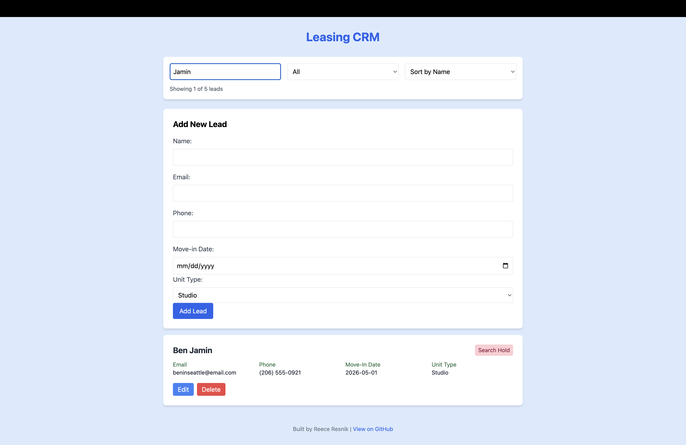
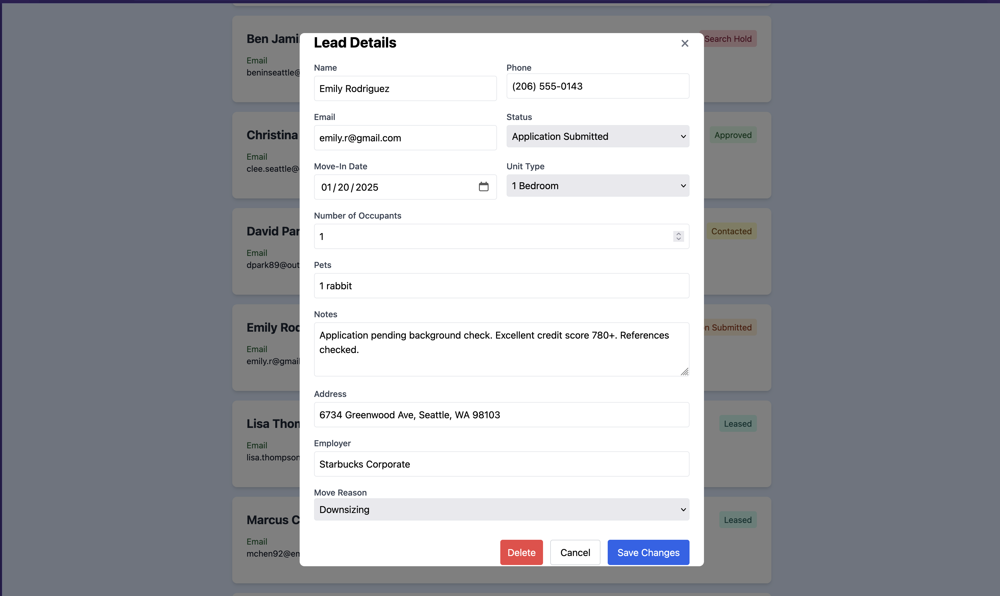

# Leasing CRM

🏠 **Live Demo:** https://leasing-crm.vercel.app/

A modern CRM system built specifically for apartment leasing professionals, featuring lead tracking, status management, and conversion analytics.

## 🚀 Features

- **Lead Management**: Add, edit, delete, and track potential residents
- **Status Tracking**: Monitor leads through the leasing pipeline (New Inquiry → Tour → Application → Leased)
- **Search & Filter**: Find leads quickly by name, email, or status
- **Smart Sorting**: Organize leads by name or status
- **Data Persistence**: All data saved on a Firebase database
- **Responsive Design**: Works seamlessly on desktop and mobile devices
- **Real-time Updates**: Instant search and filter results as you type
- **Lead Scoring Engine**: Rule-based priority scoring system that evaluates urgency, engagement, and demand factors
- **Smart Recommendations**: Automated action suggestions based on lead score and status

## 🛠️ Built With

- **React 18** - Frontend framework
- **Vite** - Lightning-fast build tool and development server
- **Tailwind CSS v3** - Utility-first CSS framework
- **JavaScript ES6+** - Modern JavaScript features
- **Python/FastAPI** - Backend API for lead scoring service
- **Vercel** - Prototype deployment
- **Firebase** - Server side data persistence

## 🤓 Knowledge Used So Far
- CRUD Operations
- React (State Management, Hooks, Component Architecture)
- REST API Integration
- Python Backend Development (FastAPI)
- Rule-based Scoring Algorithms
- Cross-Origin Resource Sharing (CORS)
- Asynchronous JavaScript (fetch, async/await)

## 💻 Getting Started

### Prerequisites
- Node.js (v14 or higher)
- npm or yarn
- Python 3.11+ (for lead scoring backend)

### Installation

1. Clone the repository
```bash
git clone https://github.com/rresnik2/leasing-crm.git
cd leasing-crm
```

2. Install frontend dependencies
```bash
npm install
```

3. Set up the Python backend (optional - for lead scoring)
```bash
cd ml-backend
python -m venv venv
source venv/bin/activate  # On Windows: venv\Scripts\activate
pip install -r requirements.txt
```

4. Start the backend server
```bash
cd ml-backend
source venv/bin/activate
python main.py
```
The API will run at [http://localhost:8000](http://localhost:8000)

5. Start the frontend development server (in a new terminal)
```bash
npm run dev
```

6. Open [http://localhost:5173](http://localhost:5173) in your browser

### Building for Production

```bash
npm run build
```

The built files will be in the `dist` directory, ready for deployment.

## 📸 Screenshots

### Lead Management



### Edit Lead


## 🎯 Use Cases

This CRM is designed for:
- Leasing agents managing apartment inquiries
- Property managers tracking rental pipeline
- Real estate professionals handling residential leads
- Small to medium property management companies

## 📊 Lead Status Pipeline

The CRM tracks leads through these stages:
- **New Inquiry** - Initial contact
- **Contacted** - First response sent
- **Tour Scheduled** - Viewing appointment set
- **Tour Completed** - Property shown
- **Application Submitted** - Rental application received
- **Approved** - Application accepted
- **Leased** - Lease signed
- **Search Hold** - Temporarily paused
- **Not Interested** - Lead declined
- **Leased Elsewhere** - Chose another property

## 🔜 Future Enhancements

- [ ] Dashboard with conversion analytics
- [X] Backend API integration (Firebase)
- [ ] User authentication and multi-user support
- [ ] Email integration for automated follow-ups
- [ ] Export leads to CSV/Excel
- [ ] Calendar integration for tour scheduling
- [ ] Notes and communication history
- [ ] Advanced reporting and metrics

## 🤝 Contributing

Contributions are welcome! Feel free to open issues or submit pull requests.

## 👤 Author

**Reece Resnik**
- GitHub: @rresnik2 (https://github.com/rresnik2)
- LinkedIn: Reece Resnik (https://linkedin.com/in/reece-resnik)
- Email: rresnik2@gmail.com

## 📝 License

This project is open source and available under the MIT License

## 🙏 Acknowledgments

- Built as a portfolio project to demonstrate React and modern web development skills
- Inspired by real-world experience in the apartment leasing industry
